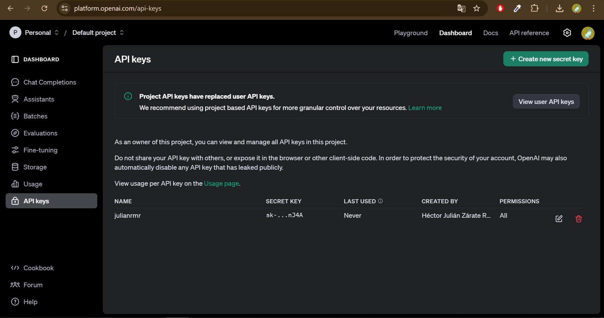
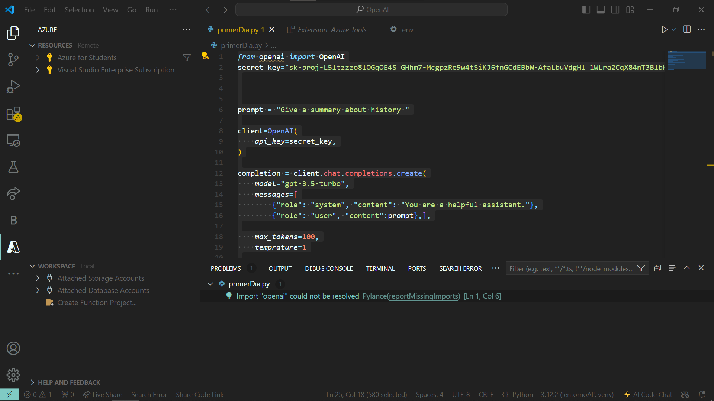
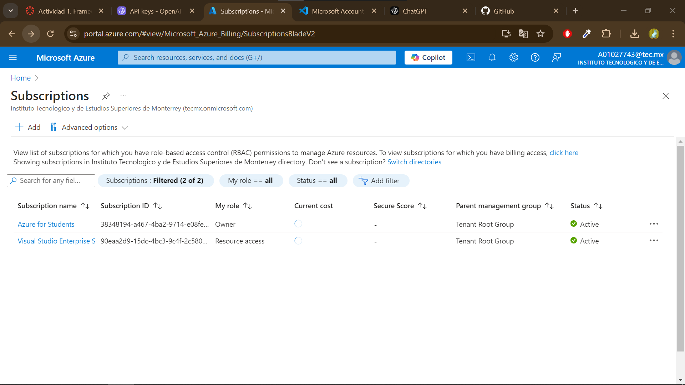
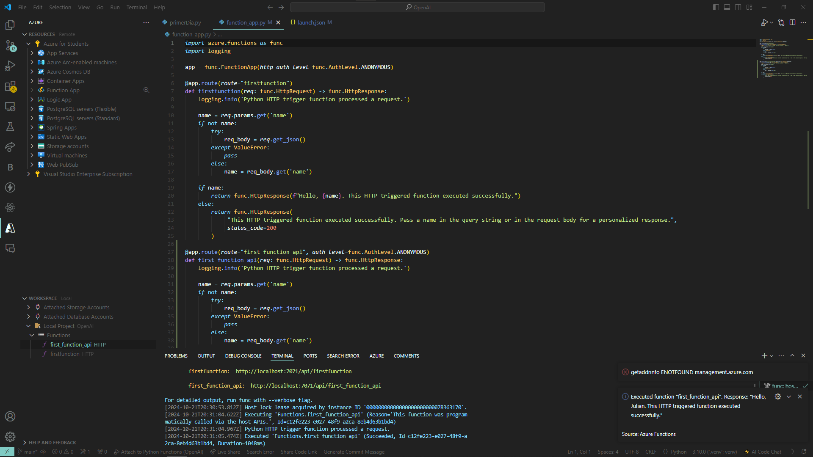
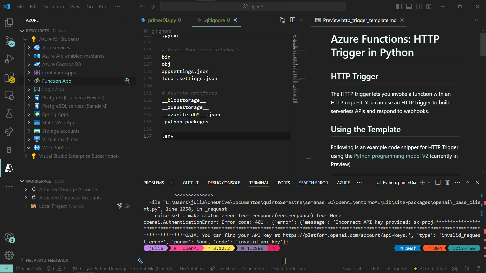
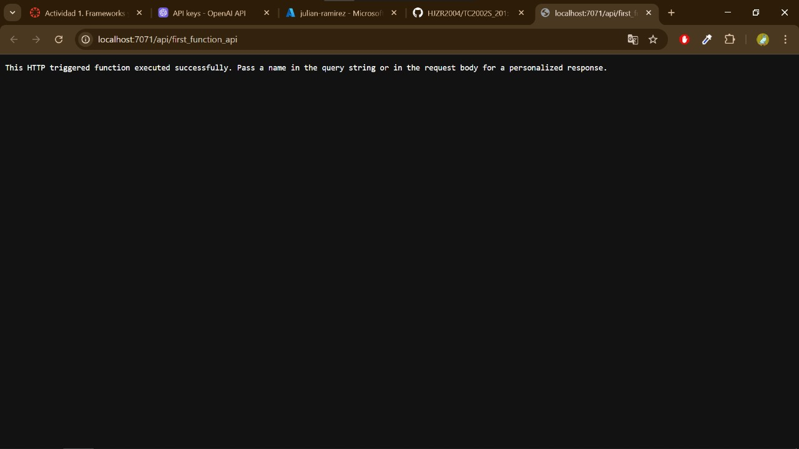

# OPEN AI

### 1. Recurso Azure

- En la primera parte de la clase, tuvimos que ingresar a la página de OpenAI para obtener nuestra API Key.

### 2. Conexión con la API

- Tuvimos que crear un script llamado `primerDia.py` para comprobar si teníamos conexión con la API creada.
- Al darnos cuenta de que nuestra cuenta no tenía saldo para hacer solicitudes, el profesor nos brindó su API Key. Sin embargo, esta API Key fue bloqueada posteriormente, por lo que no pudimos comprobar la conexión exitosamente.

### 3. Azure

- Usamos Azure para crear una Function App mediante la suscripción de Azure para estudiantes. Después de agregar las extensiones en VS Code, pudimos desplegar la Function App, lo cual generó el archivo `function_app.py`.

### 4. Despliegue

- Después de ejecutar la función HTTP, se nos pidió un nombre en el cuerpo de la solicitud, el cual fue respondido con un mensaje personalizado.

